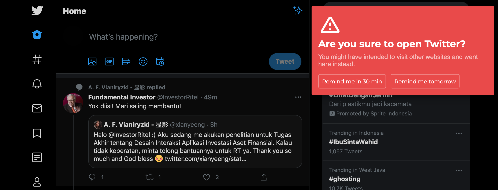

# Twitter Warning Extension

This is a Chrome extension that shows a prompt to see if you really intend to open Twitter or just mistakenly typed `twitter.com`.



## Installation Guide
Since the extension is not available on the Chrome Web Store, this is what you have to do:
1. Download the [source code ZIP file](https://github.com/didithilmy/twitter-warning-extension/archive/main.zip) and unzip it somewhere.
2. Open `chrome://extensions` in Chrome.
3. Turn on Developer mode (usually in the top-right).
4. Click on "Load Unpacked".
5. Select the folder that was unzipped.
6. Open `twitter.com` and enjoy!

## Disclaimer
This extension is provided "as is" without any guarantee whatsoever. Feel free to fork, tinker, or do whatever you want to the source code.


## License
```
MIT License

Copyright (c) 2020 Muhammad Aditya Hilmy

Permission is hereby granted, free of charge, to any person obtaining a copy
of this software and associated documentation files (the "Software"), to deal
in the Software without restriction, including without limitation the rights
to use, copy, modify, merge, publish, distribute, sublicense, and/or sell
copies of the Software, and to permit persons to whom the Software is
furnished to do so, subject to the following conditions:

The above copyright notice and this permission notice shall be included in all
copies or substantial portions of the Software.

THE SOFTWARE IS PROVIDED "AS IS", WITHOUT WARRANTY OF ANY KIND, EXPRESS OR
IMPLIED, INCLUDING BUT NOT LIMITED TO THE WARRANTIES OF MERCHANTABILITY,
FITNESS FOR A PARTICULAR PURPOSE AND NONINFRINGEMENT. IN NO EVENT SHALL THE
AUTHORS OR COPYRIGHT HOLDERS BE LIABLE FOR ANY CLAIM, DAMAGES OR OTHER
LIABILITY, WHETHER IN AN ACTION OF CONTRACT, TORT OR OTHERWISE, ARISING FROM,
OUT OF OR IN CONNECTION WITH THE SOFTWARE OR THE USE OR OTHER DEALINGS IN THE
SOFTWARE.
```